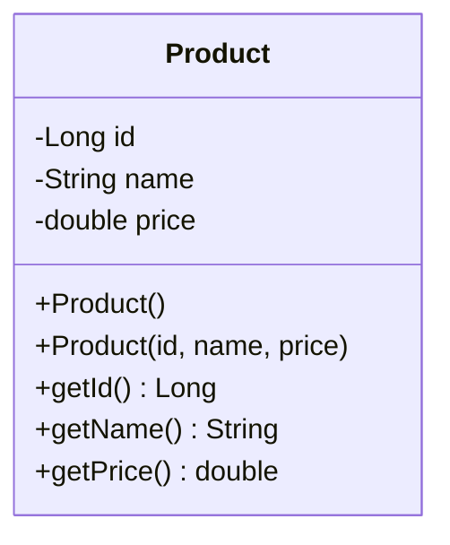

# Product UML Class Diagram

```mermaid
classDiagram
 class Product {
 -Long id
 -String name
 -double price
 +Product()
 +Product(id, name, price)
 +getId() Long
 +getName() String
 +getPrice() double
 }
```
